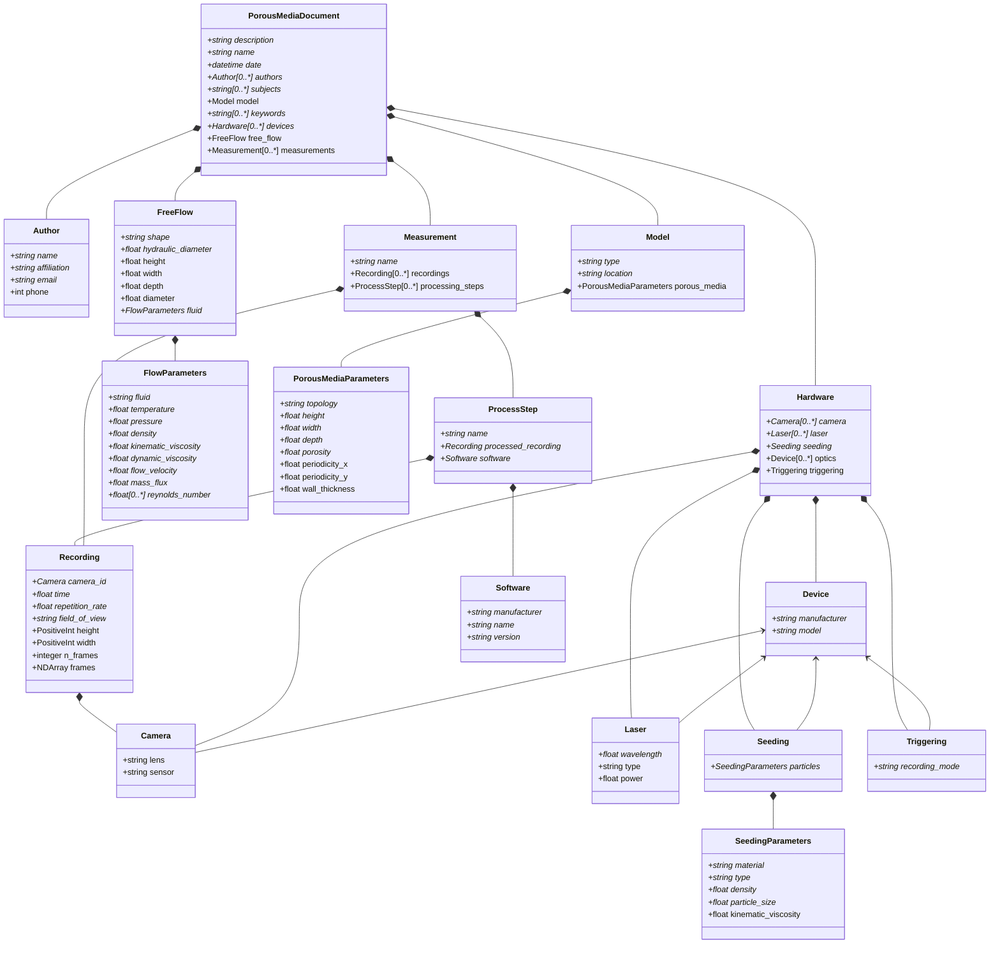

```mermaid
classDiagram
    Device <-- Camera
    Device <-- Laser
    Device <-- Seeding
    Device <-- Triggering
    PorousMediaDocument *-- Author
    PorousMediaDocument *-- FreeFlow
    PorousMediaDocument *-- Model
    PorousMediaDocument *-- Hardware
    PorousMediaDocument *-- Measurement
    FreeFlow *-- FlowParameters
    Model *-- PorousMediaParameters
    Hardware *-- Device
    Hardware *-- Camera
    Hardware *-- Laser
    Hardware *-- Seeding
    Hardware *-- Triggering
    Seeding *-- SeedingParameters
    Measurement *-- ProcessStep
    Measurement *-- Recording
    ProcessStep *-- Software
    ProcessStep *-- Recording
    Recording *-- Camera
    
    class PorousMediaDocument {
        +string description*
        +string name*
        +datetime date*
        +Author[0..*] authors*
        +string[0..*] subjects*
        +Model model
        +string[0..*] keywords*
        +Hardware[0..*] devices*
        +FreeFlow free_flow
        +Measurement[0..*] measurements
    }
    
    class Author {
        +string name*
        +string affiliation*
        +string email*
        +int phone
    }
    
    class FreeFlow {
        +string shape*
        +float hydraulic_diameter*
        +float height
        +float width
        +float depth
        +float diameter
        +FlowParameters fluid*
    }
    
    class FlowParameters {
        +string fluid*
        +float temperature*
        +float pressure*
        +float density*
        +float kinematic_viscosity*
        +float dynamic_viscosity*
        +float flow_velocity*
        +float mass_flux*
        +float[0..*] reynolds_number*
    }
    
    class Model {
        +string type*
        +string location*
        +PorousMediaParameters porous_media
    }
    
    class PorousMediaParameters {
        +string topology*
        +float height*
        +float width*
        +float depth*
        +float porosity*
        +float periodicity_x
        +float periodicity_y
        +float wall_thickness
    }
    
    class Hardware {
        +Camera[0..*] camera*
        +Laser[0..*] laser*
        +Seeding seeding*
        +Device[0..*] optics
        +Triggering triggering
    }
    
    class Device {
        +string manufacturer*
        +string model*
    }
    
    class Camera {
        +string lens
        +string sensor
    }
    
    class Laser {
        +float wavelength*
        +string type
        +float power
    }
    
    class Seeding {
        +SeedingParameters particles*
    }
    
    class SeedingParameters {
        +string material*
        +string type*
        +float density*
        +float particle_size*
        +float kinematic_viscosity
    }
    
    class Triggering {
        +string recording_mode*
    }
    
    class Measurement {
        +string name*
        +Recording[0..*] recordings
        +ProcessStep[0..*] processing_steps
    }
    
    class ProcessStep {
        +string name*
        +Recording processed_recording*
        +Software software*
    }
    
    class Software {
        +string manufacturer*
        +string name*
        +string version*
    }
    
    class Recording {
        +Camera camera_id*
        +float time*
        +float repetition_rate*
        +string field_of_view*
        +PositiveInt height
        +PositiveInt width
        +integer n_frames
        +NDArray frames
    }
    
```