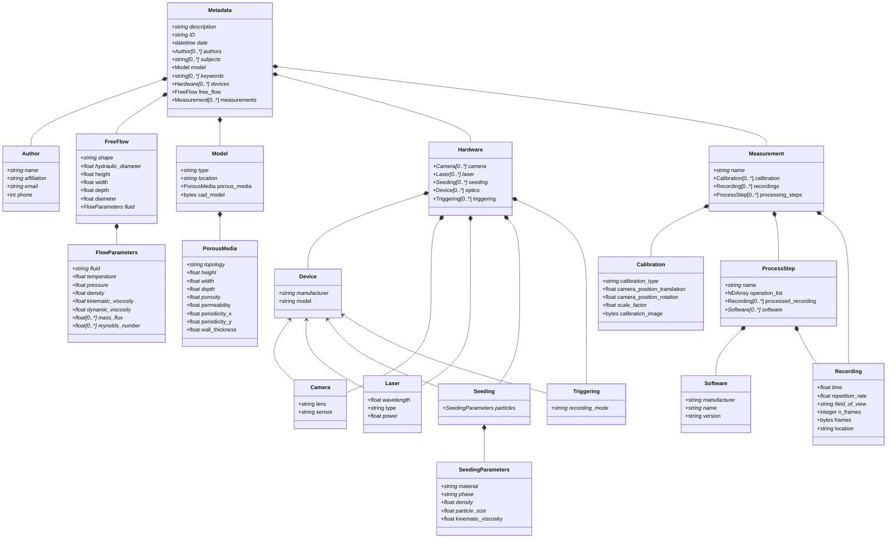

```mermaid
classDiagram
    Device <-- Camera
    Device <-- Laser
    Device <-- Seeding
    Device <-- Triggering
    Metadata *-- Author
    Metadata *-- FreeFlow
    Metadata *-- Model
    Metadata *-- Hardware
    Metadata *-- Measurement
    FreeFlow *-- FlowParameters
    Model *-- PorousMedia
    Hardware *-- Device
    Hardware *-- Camera
    Hardware *-- Laser
    Hardware *-- Seeding
    Hardware *-- Triggering
    Seeding *-- SeedingParameters
    Measurement *-- Calibration
    Measurement *-- ProcessStep
    Measurement *-- Recording
    ProcessStep *-- Software
    ProcessStep *-- Recording
    
    class Metadata {
        +string description*
        +string ID*
        +datetime date*
        +Author[0..*] authors*
        +string[0..*] subjects*
        +Model model
        +string[0..*] keywords*
        +Hardware[0..*] devices*
        +FreeFlow free_flow
        +Measurement[0..*] measurements
    }
    
    class Author {
        +string name*
        +string affiliation*
        +string email*
        +int phone
    }
    
    class FreeFlow {
        +string shape*
        +float hydraulic_diameter*
        +float height
        +float width
        +float depth
        +float diameter
        +FlowParameters fluid*
    }
    
    class FlowParameters {
        +string fluid*
        +float temperature*
        +float pressure*
        +float density*
        +float kinematic_viscosity*
        +float dynamic_viscosity*
        +float[0..*] mass_flux*
        +float[0..*] reynolds_number*
    }
    
    class Model {
        +string type*
        +string location*
        +PorousMedia porous_media
        +bytes cad_model
    }
    
    class PorousMedia {
        +string topology*
        +float height*
        +float width*
        +float depth*
        +float porosity*
        +float permeability
        +float periodicity_x
        +float periodicity_y
        +float wall_thickness
    }
    
    class Hardware {
        +Camera[0..*] camera*
        +Laser[0..*] laser*
        +Seeding[0..*] seeding*
        +Device[0..*] optics
        +Triggering[0..*] triggering
    }
    
    class Device {
        +string manufacturer*
        +string model
    }
    
    class Camera {
        +string lens
        +string sensor
    }
    
    class Laser {
        +float wavelength*
        +string type
        +float power
    }
    
    class Seeding {
        +SeedingParameters particles*
    }
    
    class SeedingParameters {
        +string material*
        +string phase*
        +float density*
        +float particle_size*
        +float kinematic_viscosity
    }
    
    class Triggering {
        +string recording_mode*
    }
    
    class Measurement {
        +string name*
        +Calibration[0..*] calibration
        +Recording[0..*] recordings
        +ProcessStep[0..*] processing_steps
    }
    
    class Calibration {
        +string calibration_type*
        +float camera_position_translation
        +float camera_position_rotation
        +float scale_factor*
        +bytes calibration_image
    }
    
    class ProcessStep {
        +string name*
        +NDArray operation_list
        +Recording[0..*] processed_recording
        +Software[0..*] software*
    }
    
    class Software {
        +string manufacturer*
        +string name*
        +string version
    }
    
    class Recording {
        +float time*
        +float repetition_rate*
        +string field_of_view*
        +integer n_frames
        +bytes frames
        +string location
    }
    
```