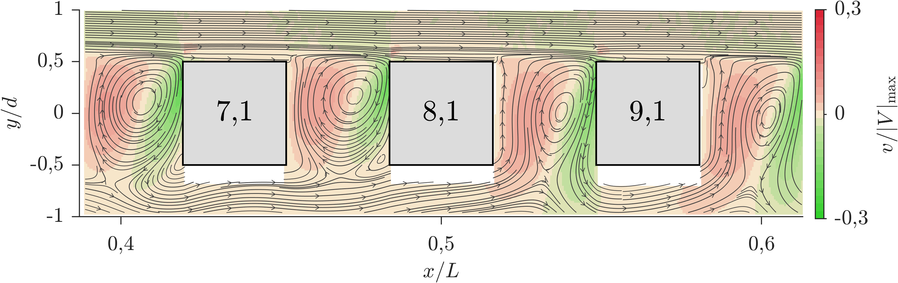

# 🌊 Porous Media Flow Model

Porous Media Flow Model is a comprehensive framework for storing and analyzing data of turbulent fluid flows adjacent to porous media structures. The data model is designed to support detailed investigations of flow behavior at the interface between a turbulent free flow and a porous medium, with particular emphasis on energy, mass, and momentum transfer.

A key focus of this framework is the integration and analysis of data obtained through Particle Image Velocimetry (PIV). PIV is an optical, particle-based measurement technique that provides instantaneous velocity measurements. Small tracer particles are seeded into the turbulent flow and illuminated with a laser sheet. By capturing two consecutive images, the displacement of particles is analyzed, resulting in time and space-resolved velocity profiles and flow structures.

Due to the high spatial and temporal resolution of PIV data, the technique generates enormous amounts of raw data, which presents challenges in terms of storage and data handling. To adress this, the framework includes a data model that minimizes storage requirements while ensuring the reproducibility and accessibility of data for numerical simulations and further investigations.

This project is part of EXC2075 PN1-3 research initiative.

## 🔍 Overview

This project focuses on understanding turbulent pumping mechanisms in different porous structure topologies with varying characteristic scales. The framework provides tools for analyzing:

- ⏱️ Time-resolved velocity measurements
- 📊 Time-averaged velocity measurements
- 🔄 Fluid flow interactions at the interface between turbulent free flow and porous structures

## 💻 Available Implementations

The framework is implemented in multiple languages to support different use cases:

- **porous-media-py**: 🐍 Python implementation
  - Core data processing and analysis
  - PIV data handling
  - Visualization tools

- **porous-media-jl**: 🔷 Julia implementation
  - High-performance computing
  - Numerical simulations
  - Fast data processing

- **porous-media-ts**: 📱 TypeScript implementation
  - Web-based visualization
  - Interactive data exploration
  - Client-side processing

- **porous-media-go**: 🚀 Go implementation
  - High-performance server components
  - Data streaming
  - Concurrent processing

- **porous-media-rs**: 🦀 Rust implementation
  - High-performance components
  - Data streaming
  - Concurrent processing

## 📋 Data Model

The framework implements a standardized data storage format for PIV recordings with high spatiotemporal resolution. Key components include:

- **Metadata Management**: 📝 Comprehensive tracking of experimental parameters
- **Hardware Specifications**: 🔧 Detailed documentation of experimental setup
- **Flow Parameters**: 💧 Structured storage of fluid properties and conditions
- **Measurement Data**: 📈 Standardized format for PIV recordings
- **Processing Pipeline**: ⚙️ Documented workflow for data processing

## 📁 Project Structure

- `specifications/`: 📄 Data model specifications
- `diagrams/`: 🔄 System architecture and flow diagrams
- `schemes/`: 🗂️ Data schemas and validation rules
- `docs/`: 📚 Documentation and usage guides
