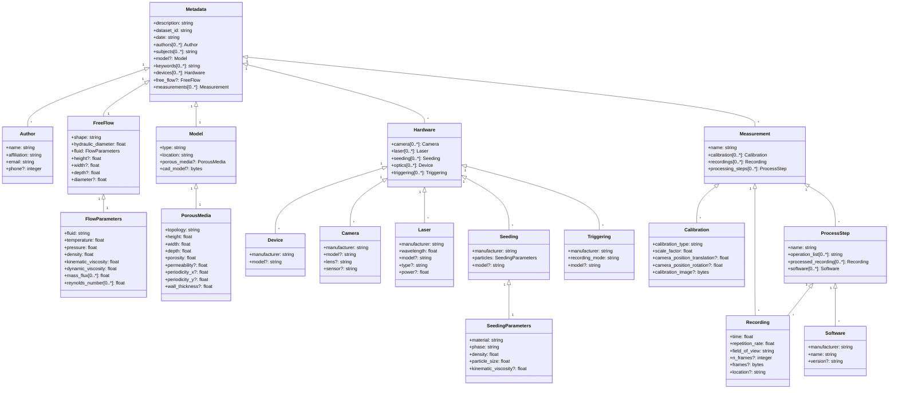

```mermaid
classDiagram
    %% Class definitions with attributes
    class Metadata {
        +description: string
        +dataset_id: string
        +date: string
        +authors[0..*]: Author
        +subjects[0..*]: string
        +model?: Model
        +keywords[0..*]: string
        +devices[0..*]: Hardware
        +free_flow?: FreeFlow
        +measurements[0..*]: Measurement
    }

    class Author {
        +name: string
        +affiliation: string
        +email: string
        +phone?: integer
    }

    class FreeFlow {
        +shape: string
        +hydraulic_diameter: float
        +fluid: FlowParameters
        +height?: float
        +width?: float
        +depth?: float
        +diameter?: float
    }

    class FlowParameters {
        +fluid: string
        +temperature: float
        +pressure: float
        +density: float
        +kinematic_viscosity: float
        +dynamic_viscosity: float
        +mass_flux[0..*]: float
        +reynolds_number[0..*]: float
    }

    class Model {
        +type: string
        +location: string
        +porous_media?: PorousMedia
        +cad_model?: bytes
    }

    class PorousMedia {
        +topology: string
        +height: float
        +width: float
        +depth: float
        +porosity: float
        +permeability?: float
        +periodicity_x?: float
        +periodicity_y?: float
        +wall_thickness?: float
    }

    class Hardware {
        +camera[0..*]: Camera
        +laser[0..*]: Laser
        +seeding[0..*]: Seeding
        +optics[0..*]: Device
        +triggering[0..*]: Triggering
    }

    class Device {
        +manufacturer: string
        +model?: string
    }

    class Camera {
        +manufacturer: string
        +model?: string
        +lens?: string
        +sensor?: string
    }

    class Laser {
        +manufacturer: string
        +wavelength: float
        +model?: string
        +type?: string
        +power?: float
    }

    class Seeding {
        +manufacturer: string
        +particles: SeedingParameters
        +model?: string
    }

    class SeedingParameters {
        +material: string
        +phase: string
        +density: float
        +particle_size: float
        +kinematic_viscosity?: float
    }

    class Triggering {
        +manufacturer: string
        +recording_mode: string
        +model?: string
    }

    class Measurement {
        +name: string
        +calibration[0..*]: Calibration
        +recordings[0..*]: Recording
        +processing_steps[0..*]: ProcessStep
    }

    class Calibration {
        +calibration_type: string
        +scale_factor: float
        +camera_position_translation?: float
        +camera_position_rotation?: float
        +calibration_image?: bytes
    }

    class ProcessStep {
        +name: string
        +operation_list[0..*]: string
        +processed_recording[0..*]: Recording
        +software[0..*]: Software
    }

    class Software {
        +manufacturer: string
        +name: string
        +version?: string
    }

    class Recording {
        +time: float
        +repetition_rate: float
        +field_of_view: string
        +n_frames?: integer
        +frames?: bytes
        +location?: string
    }

    %% Enum definitions
    %% Relationships
    Metadata "1" <|-- "*" Author
    Metadata "1" <|-- "1" Model
    Metadata "1" <|-- "*" Hardware
    Metadata "1" <|-- "1" FreeFlow
    Metadata "1" <|-- "*" Measurement
    FreeFlow "1" <|-- "1" FlowParameters
    Model "1" <|-- "1" PorousMedia
    Hardware "1" <|-- "*" Camera
    Hardware "1" <|-- "*" Laser
    Hardware "1" <|-- "*" Seeding
    Hardware "1" <|-- "*" Device
    Hardware "1" <|-- "*" Triggering
    Seeding "1" <|-- "1" SeedingParameters
    Measurement "1" <|-- "*" Calibration
    Measurement "1" <|-- "*" Recording
    Measurement "1" <|-- "*" ProcessStep
    ProcessStep "1" <|-- "*" Recording
    ProcessStep "1" <|-- "*" Software
```