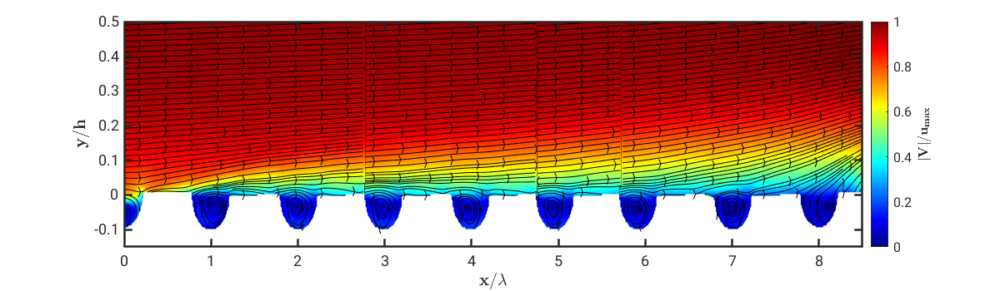

# Dataset EXC2075 PN1-3

- [Dataset EXC2075 PN1-3](#dataset-exc2075-pn1-3)
  - [General information](#general-information)
    - [PorousMediaDocument](#porousmediadocument)
    - [Author](#author)
  - [Model specifications](#model-specifications)
    - [FreeFlow](#freeflow)
    - [FlowParameters](#flowparameters)
    - [Model](#model)
    - [PorousMediaParameters](#porousmediaparameters)
  - [Experimental setup](#experimental-setup)
    - [Hardware](#hardware)
    - [Device](#device)
    - [Camera \[_Device_\]](#camera-device)
    - [Laser \[_Device_\]](#laser-device)
    - [Seeding \[_Device_\]](#seeding-device)
    - [SeedingParameters](#seedingparameters)
    - [Triggering \[_Device_\]](#triggering-device)
  - [Methods](#methods)
    - [Measurement](#measurement)
    - [ProcessStep](#processstep)
    - [Software](#software)
    - [Recording](#recording)

This is the preliminary Markdown-file of EXC2075 PN1-3. The main goal of this document is to define a data storage standard for Particle Image Velocimetry (PIV) recordings. The data model is still under developement.

PIV is an optical, particle-based measurement technique used to measure fluid flow velocities. By illuminating small particles in the flow field with a laser sheet and analyzing their displacement between two consecutive images, PIV provides highly time and space resolved data on velocity profiles and flow structures.
EXC2075 PN1-3 focuses on understanding the turbulent pumping mechanisms in different porous structures topologies with different characteristic porous scales.
These fluid flow interactions between energy, mass and momentum transfer need to be further understood to improve engineering applications such as transpiration cooling, filtration processes and heat exchangers.
To that aim time-resolved velocity measurements were performed at the interface between a turbulent free flow and various porous structures.

  

## General information

In this section the most important general information on the stored data set is listed here including for example a brief description, the ID of the dataset, the research subjects covered by the dataset.
It also provides the name of the author who worked on the dataset and the corresponing e-mail address as well as the affiliation.

### PorousMediaDocument

The Porous Media Document summarizes key information about a dataset pertaining turbulent pumping induced by turbulence at the interface of a porous media model and a turbulent free flow. It includes a description of the dataset's content, a descriptive name or ID of the dataset, and the date of creation. It also lists the contributors, highlights the research areas which are covered and specifies the specific porous media model investigated. Descriptive keywords help categorize the dataset and the the hardware used in the experiment is also stored. Free flow conditions of the turbulent air flow are also stored. The Porous Media Document provides detailed information about the measurements conducted in the experiment.

  
<i>Inspect attributes</i>

- __description__
  - Type: string
  - Description: Describes the content of the dataset
- __name__
  - Type: string
  - Description: Descriptive name of the dataset / ID
- __date__
  - Type: datetime
  - Description: Date/time when the dataset was created
- __authors__
  - Type: [Author](#author)
  - Multiple: True
  - Description: Persons who worked on the dataset
- __subjects__
  - Type: string
  - Multiple: True
  - Description: Research subjects covered by the dataset
- model
  - Type: Model
  - Description: Porous media model investigated in this dataset
- __keywords__
  - Type: string
  - Multiple: True
  - Description: Descriptive keywords to describe the datase (examples: PIV, time-resolved, time-averaged)
- __devices__
  - Type: [Hardware](#hardware)
  - Description: Devices used in this experiment
  - Multiple: True
- free_flow
  - Type: [FreeFlow](#freeflow)
  - Description: Free flow of the measurement
- measurements
  - Type: [Measurement](#measurement)
  - Description: Contains all measurements done in this experiment
  - Multiple: True

### Author

The Author section provides information about the persons involved in working on or creating the dataset.
These information helps establish the identity and contact details of the authors associated with the dataset.

  
<i>Inspect attributes</i>

- __name__
  - Type: string
  - Description: Full name of the author
- __affiliation__
  - Type: string
  - Description: Organisation the author is affiliated with
- __email__
  - Type: string
  - Description: Contact e-mail adress of the author
- phone
  - Type: int
  - Description: Contact phone number of the author

## Model specifications

The Model specifications provide information about the shape, dimensions, and working fluid of the free flow channel.
It includes details such as the hydraulic diameter of the channel as well as the height, width and depth of the channel. 
Furthermore, fluid parameters and porous media parameters are listed, which allows a comprehensive understanding of the experimental setup.

### FreeFlow

The Free Flow section contains information about the shape, dimensions, and working fluid of the free flow channel.
It provides details such as the shape of the flow channel's cross-section, the hydraulic diameter, height, width and depth of the channel and a description of the flow parameters of the working fluid.

  
<i>Inspect attributes</i>

- __shape__
  - Type: string
  - Description: Shape of the flow channels cross section
- __hydraulic_diameter__
  - Type: float
  - Description: Value of the hydraulic diameter in m
- height
  - Type: float
  - Description: Value of the flow channel height in m
- width
  - Type: float
  - Description: Value of the flow channel width in m
- depth
  - Type: float
  - Description: Value of the flow channel depth in m
- diameter
  - Type: float
  - Description: Value of the flow channel diameter in m
- __fluid__
  - Type: [FlowParameters](#flowparameters)
  - Description: Description of flow parameters

### FlowParameters

The Flow Parameters encompasses crucial details about the flow parameters of the working fluid used in the present dataset.
These parameters provide a comprehensive understanding of the fluid's properties and flow conditions within the experiment.

  
<i>Inspect attributes</i>

- __fluid__
  - Type: string
  - Description: Name of the free flow fluid
- __temperature__
  - Type: float
  - Description: Value of the fluid temperature in K
- __pressure__
  - Type: float
  - Description: Value of the fluid pressure in bar
- __density__
  - Type: float
  - Description: Value of the fluid density in kg/m^3
- __kinematic_viscosity__
  - Type: float
  - Description: Value of the fluid kinematic viscosity in m^2/s
- __dynamic_viscosity__
  - Type: float
  - Description: Value of the dynamic fluid viscosity in mPas
- __flow_velocity__
  - Type: float
  - Description: Value of the fluid flow velocity in m/s
- __mass_flux__
  - Type: float
  - Description:  Value of the fluid mass flux in kg/s
- __reynolds_number__
  - Type: float
  - Multiple: True
  - Description: Value(s) of investigated Reynolds number(s)

### Model

  
<i>Inspect attributes</i>

The Model section contains information about the location of the object in the flow channel.
It provides details regarding the type of the present porous media model, its location relative to the free flow and if applicable, detailed parameters related to the porous media model which is used. 

- __type__
  - Type: string
  - Description: What kind of object is located inside the flow channel? (porous media model, cylinder, ...)

- __location__
  - Type: string
  - Description: Where is the object located inside the flow channel? (in, adjascent to, ... the free flow)

- porous_media
  - Type: [PorousMediaParameters](#porousmediaparameters)
  - Description: Description of porous media parameters

### PorousMediaParameters

The Porous Media Parameters contain significant information regarding the parameters associated with the utilized porous media model.
They include the topology of the porous media model, the dimensions and other relevant material properties.

  
<i>Inspect attributes</i>

- __topology__
  - Type: string
  - Description: Definition of the porous media model topology (rods, cylinders, minimal surface, ...)
- __height__
  - Type: float
  - Description: Value of the porous media model height in m
- __width__
  - Type: float
  - Description: Value of the porous media model width in m
- __depth__
  - Type: float
  - Description: Value of the porous media model depth in m
- __porosity__
  - Type: float
  - Description: Value of the porous media model porosity
- periodicity_x
  - Type: float
  - Description: Value of the porous media model periodicity in x-direction in m
- periodicity_y
  - Type: float
  - Description: Value of the porous media model periodicity in y-direction in m
- wall_thickness
  - Type: float
  - Description: Value of the porous media model wall thickness in m

## Experimental setup

The Experimental setup provides detailed information about the hardware devices used for capturing the PIV data of the present dataset.
The Hardware container includes descriptions of the camera systems, laser systems, seeding devices and materials, optical devices, and triggering systems utilized during the experiment.

### Hardware

The Hardware includes descriptions of the camera systems, laser systems, seeding devices and materials, optical devices, and triggering systems utilized during the experiment.

  
<i>Inspect attributes</i>

- __camera__
  - Type : [Camera](#camera-device)
  - Multiple: True
  - Description: Description of the used camera system
- __laser__
  - Type: [Laser](#laser-device)
  - Multiple: True
  - Description: Description of the used laser system
- __seeding__
  - Type: [Seeding](#seeding-device)
  - Description: Description of the used seeding device and seeding material
- optics
  - Type: [Device](#device)
  - Multiple: True
  - Description: Description of the used optical devices (laserarm, lenses, beamsplitter, sheet optics, ...)
- triggering
  - Type: [Triggering](#triggering-device)
  - Description: Description of the used triggering devices

### Device

The Device provides general information about the manufacturer and model of the used devices such as cameras, lasers, optics, triggering and seeding systems.

  
<i>Inspect attributes</i>

- __manufacturer__
  - Type: string
  - Description: Name of the device's manufacturer
- __model__
  - Type: string
  - Description: Name of the device's model

### Camera [_Device_]

It specifies details about the camera lenses and sensors which are used.

  
<i>Inspect attributes</i>

- lens
  - Type: string
  - Description: Name of the camera lens
- sensor
  - Type: string
  - Description: Description of the camera sensor

### Laser [_Device_]

The Laser provides information about the laser wavelength, either the laser is pulsed or continous and the laser power.

  
<i>Inspect attributes</i>

- __wavelength__
  - Type: float
  - Description: Value of the used wavelength
- type
  - Type: string
  - Description: Pulsed or continous wave laser?
- power
  - Type: float
  - Description: value of the laser power

### Seeding [_Device_]

The Seeding describes the material of the seeding particles, the type of them as well as their density, particle size, and kinematic viscosity.

  
<i>Inspect attributes</i>

- __particles__
  - Type: [SeedingParameters](#seedingparameters)
  - Description: Seeding parameters of the used seeding material

### SeedingParameters

The Seeding Parameters contains crucial information about the seeding material used in the experiment.
It includes details such as the material name, particle type, density, particle size and the kinematic viscosity of the seeding particles.
These parameters provide valuable insights into the characteristics of the seeding material and its influence on the fluid flow behavior within the experimental setup.

  
<i>Inspect attributes</i>

- __material__
  - Type: string
  - Description: Name of the seeding material
- __type__
  - Type: string
  - Description: Solid or liquid particles?
- __density__
  - Type: float
  - Description: Value of the seeding particle density in kg/m^3
- __particle_size__
  - Type: float
  - Description: Value or span of the seeding particle diameter in m
- kinematic_viscosity
  - Type: float
  - Description: Value of the seeding particle kinematic viscosity in m^2/s

### Triggering [_Device_]

The Triggering explains the recording mode employed during the experiment.

  
<i>Inspect attributes</i>

- __recording_mode__
  - Type: string
  - Description: Type of recording mode (time-based, cyclic time-based, ...)

## Methods

The Methods present a detailed account of the experimental approach and procedures used.
It includes information about the experiment's name, the amount of recordings made during the study, and the processing steps applied to the flow measurement video data (.lvs-files).
The section also provides insights into the software used for processing and the recording parameters of the utilized camera system. 

### Measurement

The Measurement encompasses key details about the conducted experiment.

  
<i>Inspect attributes</i>

- __name__
  - Type: string
  - Description: Name of the experiment
- recordings
  - Type: [Recording](#recording)
  - Description: Recordings that have been done in the course of the experiment
  - Multiple: True
- processing_steps
  - Type: [ProcessStep](#processstep)
  - Description: Processed video data of the flow measurement
  - Multiple: True

### ProcessStep

The Process Step outlines the specific processing steps applied to the flow measurement video data.
t includes the name of each processing step, the resulting video from the processing, and the software used to post-process the data.
Additionally, files with the extension ".lvs" from the Davis 10 software can be embedded within this section, providing a comprehensive record of the processing workflow and ensuring the availability of relevant files for reference and replication.

  
<i>Inspect attributes</i>

- __name__
  - Type: string
  - Description: Name of the processing step
- __processed_recording__
  - Type: [Recording](#recording)
  - Description: Resulting video from the processing
- __software__
  - Type: [Software](#software)
  - Description: Software that has been used to perform the processing step

### Software

The Software section serves as a container for general information about the software utilized in the experiment.
It includes details such as the name of the manufacturer, the specific software name, and the version used to generate the dataset.
These details provide important context for the experiment, allowing for reproducibility and facilitating a clear understanding of the software environment in which the data analysis and processing were performed. 

  
<i>Inspect attributes</i>

- __manufacturer__
  - Type: string
  - Description: Name of the used recording software manufacturer
- __name__
  - Type: string
  - Description: Name of the used recording software
- __version__
  - Type: string
  - Description: Version of the used recording software

### Recording

The Recording contains crucial information about the parameters used during the recording process.
These parameters offer valuable insights into the experimental setup, facilitating accurate analysis and interpretation of the recorded data. 
The inclusion of the video frames allows for a visual reference and further examination of the recorded footage.

  
<i>Inspect attributes</i>

- __camera_id__
  - Type: @Camera.id
  - Description: ID of the camera that has been used
- __time__
  - Type: float
  - Description: Value of the investigated time period in s
- __repetition_rate__
  - Type: float
  - Description: Value of the recording repetition rate in Hz
- __field_of_view__
  - Type: string
  - Description: Value of the field of view in m x m
- height
  - Type: PositiveInt
  - Description: Height of the image
- width
  - Type: PositiveInt
  - Description: Width of the image
- n_frames
  - Type: integer
  - Description: Number of frames found in this video
- frames
  - Type: NDArray
  - Description: Videoframes

